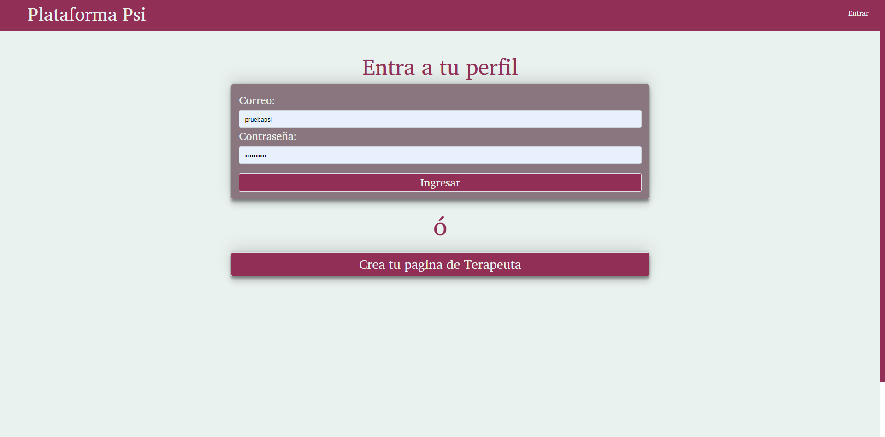
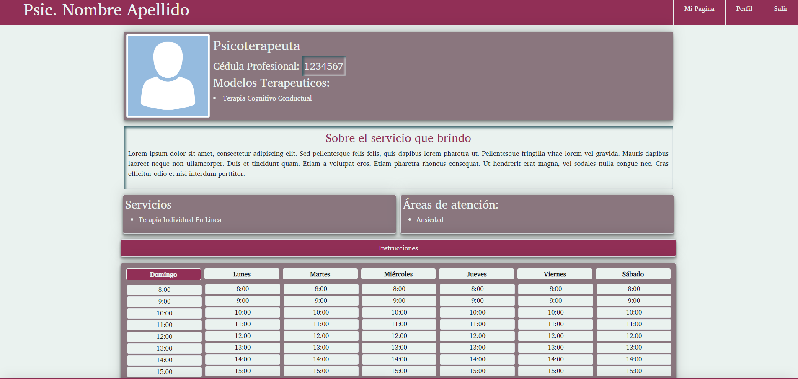

# Plataforma Psi 

  ## Description
  
  
Plataforma Psi is an app for Clinical Psychologist to share their profile, experience, schedule and important information to their Clients. The user can create a Profile to share, update their information, schedule. Functionality for adding and managing patients has started in the back-end but it will be included in future development.

  
  ## Table of Contents
  
  - [Installation](#installation)
  - [Usage](#usage)
  - [License](#license)
  - [Contributing](#license)
  - [Tests](#license)
  - [Questions](#license)
  
  ## Installation
  
  
Use create-react-app. Download the repository, edit and build. Or use the link below to access the working app.

  
  ## Usage
  
  
Follow the Installation Instructions. Create a Profile and Update it.

  
  

  
  ## License
  
  
Copyright (c) 2022, Cesar San All rights reserved.
Licensed under the MIT license. 

  
  
[License](./MIT_license.txt)

  
  ## How to Contribute
  
  
No contributions at this moment.

  
  ## Tests
  
  
Follow this [link](https://plataforma-psi.herokuapp.com/)

  
  ## Questions
  
  If you have any question feel free to check my Github 
  
Username:csancheze
  
[Github](https://github.com/csancheze)

  or send me and email
  
<cesanchezesc@gmail.com>

